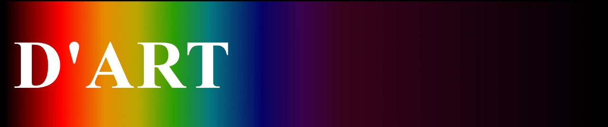

<h1>
   
</h1>

# 🚦 Índice

- [Sobre](#-Sobre)
- [Tecnologias utilizadas](#-Tecnologias-utilizadas)
- [Como baixar o projeto](#-como-baixar-o-projeto)

## 🔍 Sobre

Esse projeto consiste em um site de exposição e venda de obras de arte, feito como projeto final da capacitação de front-end e git/git-hub da empresa júnior byron.solutions.

---


## 💻 Tecnologias utilizadas 

O projeto foi desenvolvido utilizando as seguintes tecnologias

- [HTML](https://developer.mozilla.org/pt-BR/docs/Web/HTML)
- [CSS](https://developer.mozilla.org/pt-BR/docs/Web/CSS)
- [JavaScript](https://developer.mozilla.org/pt-BR/docs/Web/JavaScript)
- [Tailwind](https://tailwindcss.com/docs)
- [Git](https://git-scm.com/)
- [Git-Hub](https://github.com/)

---

## 🕡 Como baixar o projeto
```bash

   # clonar repositório
   $ git clone https://github.com/EnzoVizotto/dart

   # entrar no diretório
   $ cd projeto-final

   # instalar as dependencias
   $ yarn install

   #iniciar o projeto
   $ yarn start

```

Desenvolvido por 🍪 Enzo Vizotto e 🎨 Débora Bertini
